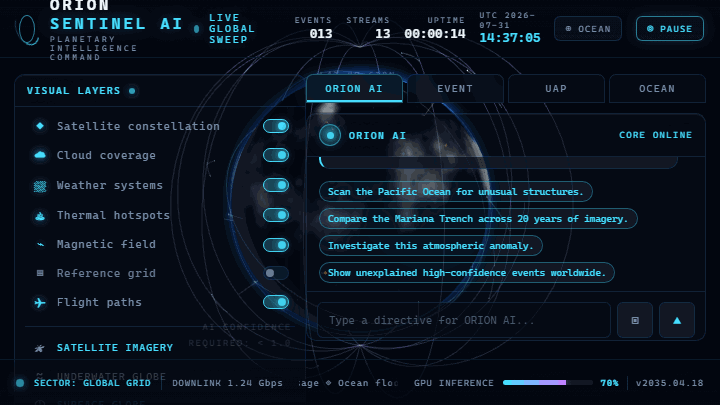

<p align="center">
  <picture>
    
  </picture>
</p>

# ORION SENTINEL AI :: PLANETARY COMMAND

**A cinematic planetary intelligence platform — real-time 3D Earth observation, simulated multi-agent AI anomaly detection, and a natural-language command assistant. Rendered as a futuristic mission-control command center.**

<p align="center">
  <a href="https://github.com/Nortaq-PlayNexus/orion-sentinel-ai/actions/workflows/ci.yml"></a>
  <a href="LICENSE"></a>
  
  
  
  
</p>

```
[ SAT ]  orbit locked. earth in view. eyes everywhere, claim nothing.
```

<pre>
IDENT ......... SENTINEL-01
CLASS ......... PLANETARY OBSERVATION PLATFORM
STATUS ........ ONLINE / CINEMATIC
SENSORS ....... SATELLITE ← OCEAN ← ATMOSPHERE ← GEOLOGY
POSTURE ....... PROBABILITY-WEIGHTED, NEVER CERTAIN
LINK .......... /orion-sentinel-ai
</pre>

---

## // 01 :: SIGNAL

ORION fuses satellite-style imagery, ocean intelligence, atmospheric tracking, and geological data — processed through a simulated multi-agent AI pipeline — into a single cinematic desktop-style web application wrapped in a fully immersive 3D Earth interface.

The platform **never asserts certainty.** Every detection is presented as a *probability-weighted hypothesis* with competing explanations, source attribution, and a verification pipeline — the way real scientific observation tooling is meant to behave.

---

## // 02 :: SENSOR ARRAY (CAPABILITIES)

### 🛰️ Real-time 3D Earth observation

- Full-screen WebGL globe (`@react-three/fiber` + `three`)
- **Real satellite imagery** — streams Google-Earth-grade tiles from the free Esri World Imagery service (toggleable, offline procedural fallback)
- Procedural day/night textures with night-time city lights and a terminator sweep
- Animated clouds, atmospheric glow, sun lighting, and a 7,000-star field
- Seamless rotate/zoom with inertial auto-orbit

### 🧠 Simulated AI scanning engine

- Continuous stream of anomaly candidates — geometric formations, thermal signatures, ocean-floor structures, UAP tracks, rapid land-cover change, wildlife biomass
- Every event carries confidence score, severity, coordinates, timestamp, competing explanations, agent attribution, and data-source tags
- Live analysis feed with per-event confidence bars

### 🌊 Ocean intelligence

- Underwater globe mode with bathymetric depth + marine-biomass density
- Pressure-zone profiles, current simulations, AI creature-identification feed

### 👽 UAP / atmospheric analysis

- Trajectory reconstruction with ground-speed and ceiling estimates
- Flight-path tables, sensor-confidence breakdowns, competing explanations — **never presented as fact**

### 🎙️ ORION command assistant

- Natural-language directives: *"Scan the Pacific Ocean for unusual structures"*
- Voice input (Chrome / Edge `SpeechRecognition`)
- Region-aware investigations that spawn live events on the globe

### 🖥️ Mission-control UI

- Glassmorphism command-center aesthetic, NASA-meets-sci-fi design language
- Real-time data streams, live ticker, GPU-inference readout, boot sequence, layer controls

---

## // 03 :: THE CONSOLE



| Main command center | Ocean intelligence mode |
|---|---|
|  |  |

| Anomaly detail panel | ORION AI assistant |
|---|---|
|  |  |

---

## // 04 :: SETUP // POWER UP

**Requirements:** [Node.js](https://nodejs.org) ≥ 20 and npm ≥ 10.

```bash
$ git clone https://github.com/Nortaq-PlayNexus/orion-sentinel-ai.git
$ cd orion-sentinel-ai
$ npm install
$ npm run dev
```

Open <http://localhost:5173>. The boot sequence initializes the command center, seeds the event grid, and the AI scanner begins streaming detections immediately.

### Production

```bash
$ npm run build        # static assets -> dist/
$ npm run preview      # serve the production build locally
```

### Docker

```bash
$ docker compose up --build     # served at http://localhost:8080
```

---

## // 05 :: FLIGHT MANUAL // OPS

### Navigating the globe

- **Drag** to rotate, **scroll** to zoom, **double-click** to snap the camera.
- Toggle layers from the left panel: satellite constellation, clouds, weather, thermal hotspots, magnetic field, flight arcs, reference grid.

### Investigating an anomaly

1. Click any pulsing marker — or any entry in the **LIVE AI ANALYSIS STREAM**.
2. The event panel opens with confidence, coordinates, detection time, competing explanations.
3. Open the **UAP** or **OCEAN** tabs for module-specific analysis.

### Talking to ORION

```text
Scan the Pacific Ocean for unusual structures.
Compare the Mariana Trench across 20 years of imagery.
Investigate this atmospheric anomaly.
Show unexplained high-confidence events worldwide.
Analyze the ocean floor.
System status.
```

### Underwater globe

Press **OCEAN** in the top bar to switch to bathymetric depth rendering, then explore the **OCEAN** module tab for pressure zones, currents, and marine-life detections.

---

## // 06 :: INTERNAL WIRING (ARCHITECTURE)

A single-page React app with clear separation between the **3D globe layer**, the **state layer**, and the **UI shell**.

```
┌──────────────────────────────────────────────────────────────┐
│  UI SHELL (React)                                             │
│  TopBar · LayerPanel · LiveFeed · OrionPanel · Event · UAP ·  │
│  OceanModule · StatusBar · BootScreen                         │
├──────────────┬───────────────────────────────┬────────────────┤
│  STATE       │  3D GLOBE (@react-three/fiber)│  SIMULATION    │
│  zustand     │  Earth · Clouds · Atmosphere  │  engine.js     │
│  store.js    │  Satellites · Heat · Magnetic │  orionAI.js    │
│              │  Weather · FlightArcs · Grid  │  geo.js        │
│              │  AnomalyMarkers · Stars       │  textures.js   │
└──────────────┴───────────────────────────────┴────────────────┘
```

- **`src/globe/`** — WebGL scene graph; `imagery.js` streams real Esri satellite tiles with procedural fallback when offline; every layer is a self-contained component driven by the shared store.
- **`src/core/`** — pure-logic modules: geospatial math (`geo.js`), anomaly engine (`engine.js`), command interpreter (`orionAI.js`), procedural texture synthesis (`textures.js`).
- **`src/store.js`** — single [Zustand](https://github.com/pmndrs/zustand) store connecting the 3D scene, analysis stream, and every UI panel.
- **`src/components/`** — mission-control UI, styled through `src/index.css` with a glassmorphism design system.

<details>
  <summary><code>$ cat manifest/stack</code></summary>

| Layer | Technology |
|---|---|
| Framework | React 19 |
| 3D / rendering | Three.js · @react-three/fiber · @react-three/drei |
| State | Zustand |
| Build | Vite 8 |
| Testing | Vitest + @vitest/coverage-v8 |
| Lint / format | oxlint · Prettier |
| Delivery | Docker · Nginx · GitHub Actions |

</details>

---

## // 07 :: COMMAND EXERCISES (DEV)

```bash
$ npm run dev             # dev server with HMR
$ npm run lint            # static analysis (oxlint)
$ npm run format          # auto-format with Prettier
$ npm run test            # unit tests (Vitest)
$ npm run test:coverage   # tests + coverage report
$ npm run build           # production bundle
$ npm run check           # lint + format + test + build in one pass
```

Run `npm run check` before opening a PR — CI runs the same gate.

---

## // 08 :: ARCHIVE // RADIO LOG

<details>
  <summary><code>$ ls docs/ - FULL MANIFEST</code></summary>

| Document | Purpose |
|---|---|
| [docs/architecture.md](docs/architecture.md) | system design, module layout, rendering pipeline |
| [docs/data-model.md](docs/data-model.md) | anomaly schema, store shape, event lifecycle |
| [docs/api.md](docs/api.md) | ORION AI command reference, agent behaviors |
| [docs/development.md](docs/development.md) | local setup, tooling, testing, release workflow |
| [docs/deployment.md](docs/deployment.md) | production build, Docker, hosting |
| [docs/security.md](docs/security.md) | security posture, disclosure, dependency hygiene |
| [CONTRIBUTING.md](CONTRIBUTING.md) | how to contribute, branching, PR process |
| [ROADMAP.md](ROADMAP.md) | planned features and direction |
| [CHANGELOG.md](CHANGELOG.md) | release history |

</details>

---

## // 09 :: LEGAL // SIGNAL

**License:** [MIT](LICENSE). Satellite imagery provided by the free public Esri World Imagery service (`Imagery © Esri, Maxar, Earthstar Geographics`); when the layer is disabled or the network is unavailable, the Earth renders with procedurally generated textures and no external asset licensing is required.

Security issues should be reported privately per [docs/security.md](docs/security.md) — **not** via public issues.

---

```
 ┌─────────────────────────────────────────────┐
 │  ORBIT LOCKED // EARTH IN VIEW              │
 │  SENTINEL-01 // OBSERVE, HYPOTHESIZE, VERIFY│
 └─────────────────────────────────────────────┘
END OF TRANSMISSION
```