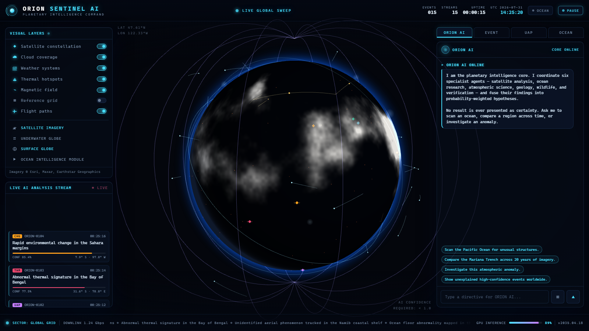
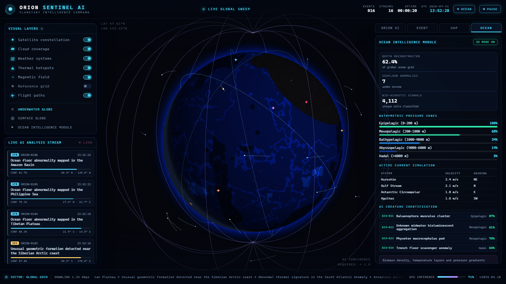
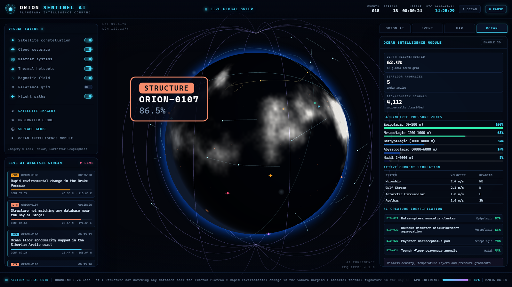
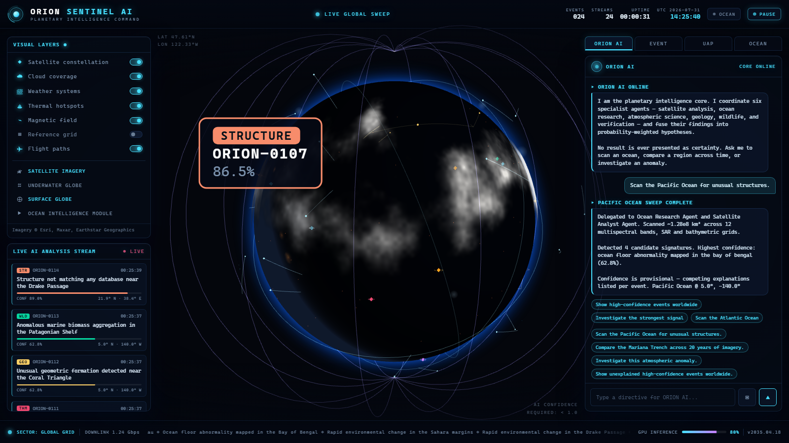

<div align="center">


# ORION Sentinel AI

**A cinematic planetary intelligence platform — real-time 3D Earth observation, AI agent analysis, and anomaly detection, rendered as a futuristic mission-control command center.**

[](LICENSE)
[](https://github.com/Nortaq-PlayNexus/orion-sentinel-ai/actions/workflows/ci.yml)
[](https://github.com/Nortaq-PlayNexus/orion-sentinel-ai/releases)
[](https://react.dev)
[](https://threejs.org)
[](https://vite.dev)
[](https://nodejs.org)

</div>

**ORION Sentinel AI** is a live AI exploration and anomaly-detection platform wrapped in a fully immersive 3D Earth interface. It fuses satellite-style imagery, ocean intelligence, atmospheric tracking, and geological data — processed through a simulated multi-agent AI pipeline — into a single cinematic desktop-style web application.

The platform never asserts certainty. Every detection is presented as a _probability-weighted hypothesis_ with competing explanations, source attribution, and a verification pipeline — the way real scientific observation tooling is meant to behave.

---

## Features

### 🛰️ Real-time 3D Earth observation

- Full-screen photorealistic-style 3D globe built on WebGL (`@react-three/fiber` + `three`)
- Procedurally generated day/night textures with night-time city lights and a terminator sweep
- Animated cloud coverage, atmospheric glow, sun lighting, and a 7,000-star field
- Seamless rotate, zoom, and exploration with inertial auto-orbit

### 🧠 Simulated AI scanning engine

- Continuous stream of anomaly candidates (geometric formations, thermal signatures, ocean-floor structures, UAP tracks, rapid land-cover change, wildlife biomass, unknown structures)
- Every event carries a **confidence score**, **severity**, coordinates, timestamp, competing explanations with probability weights, agent attribution, and data-source tags
- Live analysis feed with per-event confidence bars

### 🌊 Ocean intelligence module

- Underwater globe mode with bathymetric depth rendering and marine-biomass density
- Pressure-zone profiles, current simulations, and AI creature-identification feed

### 👽 UAP / atmospheric analysis module

- Trajectory reconstruction with ground-speed and ceiling estimates
- Flight-path tables, sensor-confidence breakdowns, and competing explanations — never presented as fact

### 🎙️ ORION AI command assistant

- Natural-language directives such as _"Scan the Pacific Ocean for unusual structures"_
- Voice input (Chrome / Edge `SpeechRecognition`)
- Region-aware investigations that spawn live events on the globe

### 🖥️ Mission-control UI

- Glassmorphism command-center aesthetic with NASA-meets-sci-fi design language
- Real-time data streams, live ticker, GPU-inference readout, boot sequence, and layer controls

---

## Screenshots

| Main command center                          | Ocean intelligence mode                   |
| -------------------------------------------- | ----------------------------------------- |
|  |  |

| Anomaly detail panel                       | ORION AI assistant                   |
| ------------------------------------------ | ------------------------------------ |
|  |  |

---

## Quick start

**Requirements:** [Node.js](https://nodejs.org) ≥ 20 and npm ≥ 10.

```bash
# 1. Clone
git clone https://github.com/Nortaq-PlayNexus/orion-sentinel-ai.git
cd orion-sentinel-ai

# 2. Install dependencies
npm install

# 3. Start the development server
npm run dev
```

Open <http://localhost:5173> (Vite prints the exact port). The boot sequence initializes the command center, seeds the event grid, and the AI scanner begins streaming detections immediately.

### Production build

```bash
npm run build        # outputs static assets to dist/
npm run preview      # serve the production build locally
```

### Docker

```bash
docker compose up --build
# ORION Sentinel AI is served at http://localhost:8080
```

---

## Usage guide

### Navigating the globe

- **Drag** to rotate, **scroll** to zoom, **double-click** to snap the camera.
- Toggle visual layers from the left panel: satellite constellation, clouds, weather, thermal hotspots, magnetic field, flight arcs, and the reference grid.

### Investigating an anomaly

1. Click any pulsing marker on the globe — or any entry in the **LIVE AI ANALYSIS STREAM**.
2. The event panel opens with confidence, coordinates, detection time, and competing explanations.
3. Open the **UAP** or **OCEAN** tabs for module-specific analysis.

### Talking to ORION AI

Try these directives in the right-hand assistant panel (or tap the mic for voice):

```text
Scan the Pacific Ocean for unusual structures.
Compare the Mariana Trench across 20 years of imagery.
Investigate this atmospheric anomaly.
Show unexplained high-confidence events worldwide.
Analyze the ocean floor.
System status.
```

### Underwater globe

Press the **OCEAN** button in the top bar to switch to bathymetric depth rendering, then explore the **OCEAN** module tab for pressure zones, currents, and marine-life detections.

---

## Architecture

The application is a single-page React app with a clear separation between the **3D globe layer**, the **state layer**, and the **UI shell**.

```
┌──────────────────────────────────────────────────────────────┐
│  UI SHELL (React)                                             │
│  TopBar · LayerPanel · LiveFeed · OrionPanel · Event · UAP ·  │
│  OceanModule · StatusBar · BootScreen                         │
├──────────────┬───────────────────────────────┬────────────────┤
│  STATE       │  3D GLOBE (@react-three/fiber)│  SIMULATION    │
│  zustand     │  Earth · Clouds · Atmosphere  │  engine.js     │
│  store.js    │  Satellites · Heat · Magnetic │  orionAI.js    │
│              │  Weather · FlightArcs · Grid  │  geo.js        │
│              │  AnomalyMarkers · Stars       │  textures.js   │
└──────────────┴───────────────────────────────┴────────────────┘
```

- **`src/globe/`** — the WebGL scene graph. Textures are generated procedurally at runtime (fully offline-capable), and every layer is a self-contained component driven by the shared store.
- **`src/core/`** — pure-logic modules: geospatial math (`geo.js`), the anomaly engine (`engine.js`), the command interpreter (`orionAI.js`), and procedural texture synthesis (`textures.js`).
- **`src/store.js`** — a single [Zustand](https://github.com/pmndrs/zustand) store that connects the 3D scene, the analysis stream, and every UI panel.
- **`src/components/`** — the mission-control UI, all styled through `src/index.css` with a glassmorphism design system.

> 📖 Deep-dive: [docs/architecture.md](docs/architecture.md) · [docs/data-model.md](docs/data-model.md) · [docs/development.md](docs/development.md)

---

## Tech stack

| Layer            | Technology                                                                                                                                           |
| ---------------- | ---------------------------------------------------------------------------------------------------------------------------------------------------- |
| Framework        | [React 19](https://react.dev)                                                                                                                        |
| 3D / rendering   | [Three.js](https://threejs.org) · [@react-three/fiber](https://docs.pmnd.rs/react-three-fiber) · [@react-three/drei](https://github.com/pmndrs/drei) |
| State management | [Zustand](https://github.com/pmndrs/zustand)                                                                                                         |
| Build tool       | [Vite 8](https://vite.dev)                                                                                                                           |
| Testing          | [Vitest](https://vitest.dev) · `@vitest/coverage-v8`                                                                                                 |
| Linting          | [oxlint](https://oxc.rs/docs/guide/usage/linter.html)                                                                                                |
| Formatting       | [Prettier](https://prettier.io)                                                                                                                      |
| Delivery         | Docker · Nginx · GitHub Actions                                                                                                                      |

---

## Development

```bash
npm run dev             # dev server with HMR
npm run lint            # static analysis (oxlint)
npm run format          # auto-format with Prettier
npm run test            # unit tests (Vitest)
npm run test:coverage   # tests + coverage report
npm run build           # production bundle
npm run check           # lint + format + test + build in one pass
```

Run `npm run check` before opening a pull request — CI runs the same gate. See [docs/development.md](docs/development.md) for the full workflow and [CONTRIBUTING.md](CONTRIBUTING.md) for contribution guidelines.

---

## Documentation

| Document                                     | Purpose                                                     |
| -------------------------------------------- | ----------------------------------------------------------- |
| [docs/architecture.md](docs/architecture.md) | System design, module layout, and rendering pipeline        |
| [docs/data-model.md](docs/data-model.md)     | Anomaly schema, store shape, and event lifecycle            |
| [docs/api.md](docs/api.md)                   | ORION AI command reference and agent behaviors              |
| [docs/development.md](docs/development.md)   | Local setup, tooling, testing, and release workflow         |
| [docs/deployment.md](docs/deployment.md)     | Production build, Docker, and hosting guidance              |
| [docs/security.md](docs/security.md)         | Security posture, disclosure policy, and dependency hygiene |
| [CONTRIBUTING.md](CONTRIBUTING.md)           | How to contribute, branching, and PR process                |
| [ROADMAP.md](ROADMAP.md)                     | Planned features and direction                              |
| [CHANGELOG.md](CHANGELOG.md)                 | Release history                                             |

---

## Contributing

Contributions of all kinds are welcome — features, fixes, documentation, and feedback.

1. Read [CONTRIBUTING.md](CONTRIBUTING.md) and the [Code of Conduct](CODE_OF_CONDUCT.md).
2. Fork the repo and create a branch (`git checkout -b feat/your-feature`).
3. Run `npm run check` locally until everything is green.
4. Open a pull request — our [PR template](.github/PULL_REQUEST_TEMPLATE.md) will guide you.

Security issues should be reported privately per our [security policy](docs/security.md) — **not** via public issues.

---

## License

Released under the [MIT License](LICENSE). The Earth visualization is procedurally generated at runtime and requires no external asset licensing.

<div align="center">

**ORION Sentinel AI** · Built with ❤️ for explorers, researchers, and future discovery organizations.

</div>
